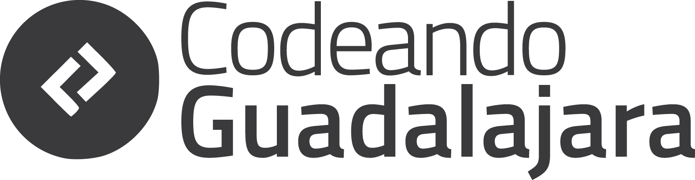

# Empieza aquí

Información relevante sobre la comunidad.

##Sobre Codeando Guadalajara

Codeando Guadalajara es la comunidad de Hacking Cívico de la ciudad de Guadalajara, Jalisco, México.

Somos una comunidad conformada por voluntarios con diferentes perfiles, quienes tenemos la visión de una cambio positivo en la sociedad a través de la tecnología.

Somos parte de un movimiento a nivel nacional llamado **Codeando México**, nuestro objetivo es propiciar que se genere tecnología que pueda responder de manera puntual a los problemas y retos del entorno social en que vivimos.

###¿Cómo lo hacemos?

#### Civic Hack Nights

Organizamos reuniones de hacking cívico en las cuales se presentan y enriquecen ideas y proyectos que puedan tener un impacto positivo en la ciudad, el estado o el país. 

#### Trabajamos en proyectos de tecnología cívica

Proyectos que surgen o adopta la comunidad, siempre abiertos a personas que quieran aportar sus habilidades para construir mejor y más rápido.

#### Colaborando con otras organizaciones

Nos gusta escuchar del trabajo de Organizaciones con las que compartimos objetivos, crear vínculos es el primer paso para crear cosas grandes. 

Algunas de las organizaciones:

- Zapopan Lab
- Secretaría de Innovación Ciencia y Tecnología de Jalisco
- Universitarios, CUAAD - UDG
- GDL ne bici

##Genial, ¿Cómo me involucro?

Algunas ideas:

* Asiste a alguna de las actividades que organizamos. Puedes encontrar el próximo evento en nuestro [Facebook](https://www.facebook.com/CodeandoGuadalajara/)

* Colabora en alguno de los proyectos existentes en la comunidad (puedes encontrarlos en la sección *repositorios*

* Invita a amigos desarrolladores, diseñadores, funcionarios públicos chidos (*govies*), compañeros de escuela o cualquier persona interesada en trabajar para construir herramientas que beneficien a la sociedad.

* Crea un issue en github para proponer un contenido, taller o proyecto a la comunidad.

### Ponte en contacto

####Slack
Únete a la conversación en slack, encuentra tu comunidad local,  checa los proyectos y temas de los que se están hablando en todo el país dando click en el siguiente botón.

#### Redes Sociales

[] (https://www.facebook.com/CodeandoGuadalajara/)

Si todo falla, envía un email a **guadalajara@codeandomexico.org**

## ¿No estás en Guadalajara?
Aquí puedes encontrar las demás comunidades del país.

[Codeando DF] (https://www.facebook.com/codeandodf/)

[Codeando Monterrey] (https://www.facebook.com/CodeandoMty/)

[Codeando Puebla] (https://www.facebook.com/codeandopuebla)

[Codeando Xalapa] (https://www.facebook.com/CodeandoXalapa)

[Codeando Aguascalientes] (https://www.facebook.com/CodeandoAgs/)

[Codeando Chihuahua] (https://www.facebook.com/CodeandoChihuahua/)

> ¿Aún sin encontrar una comunidad cerca de tí? **Empieza tu propia comunidad** (*ponte en contacto con algún representante para saber cómo*)

